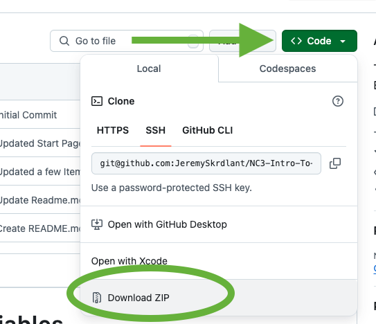
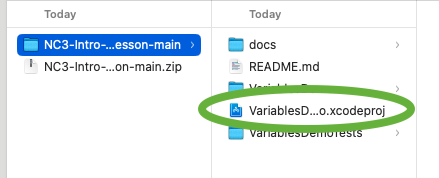

# Welcome to Swift Variables
This is designed as a live demo for students to learn about using variables in Swift.  It includes a small unit test at the end to test their knowledge.  

## The Flow 
1. Download the material and go over the basics of the Xcode IDE.
2. Use the canvas iPhone preview on the right to give a brief overfiew of the topics that we will be covering.
3. Pair with a slideshow or small reading assignment of different topics.
4. Try out what you learned from the slideshow in the play area
5. Analyze the code with both print statements that print in the debug area and Breakpoints that will go step by step through the code.
6. Copy and Paste that code to the notes area and go on to the next topic.
7. Once all the topics are covered, the students will scan the QR code with their iPad which will bring up instructions for their unit test challenge.
8. Students will fill out the unit test and if they get it correct, they will get a green checkmark.
9. On the iPads, have students reflect in their journal the lesson they have just done. 
10. Take a small break
11. Finish up the lesson with a small quiz on Kahoot or your favorite testing environment. 

## Download the Material
Start by downloading this reposistory by clicking on the Code button and choosing to download the zip.  Feel free to fork the repository if you want to make changes or make it your own. 

  

## Open the project
You will want to unzip the folder and then click on the project file to open Xcode. 

  

## Choose the Start file 
In Xcode, on the left, choose the Start_Here file to begin the lesson. 

## Enjoy the lesson 
Happy coding and enjoy learning Swift!! 
