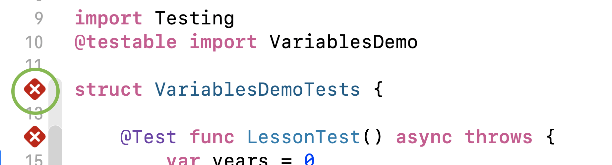

# 8 Billion People
There is a little over 8 billion people on earth.  How big is 8 billion?  Let's see how much time it would take if you counted from 1 to 8 billion.  
We will assume that you can count each number in one second and that you will not need to take any breaks.  

## Setup 
Go to the Lesson1Test.swift file in the VariablesDemoTests folder.  


## Step 1 
Createa a constant called seconds and set it equal to 8 billion.  Remember that you can use underscores ( _ ) since the comma seperators do not work.  

 ```swift
// For Example
let thousand = 1_000 
```

## Step 2 
Let's get this in minutes.  Create a variable called minutes and set it to the the seconds divided by 60.  Then create a print statement that prints out the following: 
#### It would take you 133333333 minutes 
Note that the 133333333 is the value of the mintues variables.  

To test your code, click the diamond shown in the image below.  Your test will fail but you will see the print statement. 


## Step 3 
Lets create a variable called hours and set it to the minutes divided by 60.  Create a print statement similar to one we did for the minutes. 

## Step 4 
Create a variable called days and set it to your hours divided by 24. Also print out the value for the days.  The number should be getting smaller.  

## Final Step 
We already have the variable for years.  We are going to set it to the amount of days divided by 365.  We are not to concerned about leap years for this sample.  When you run the test this time you should get a passing value. 
